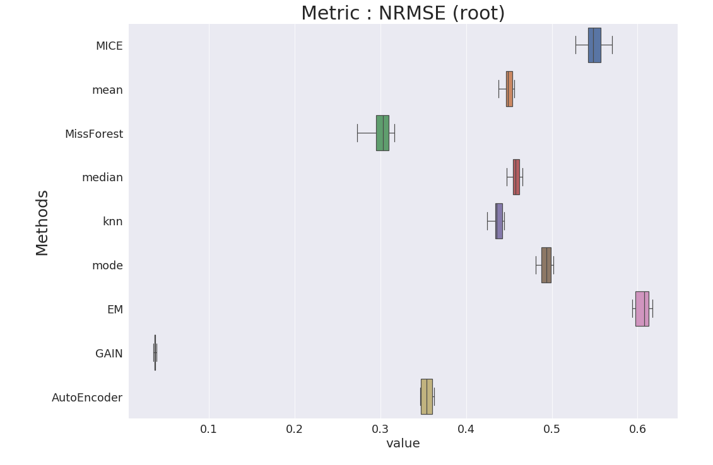
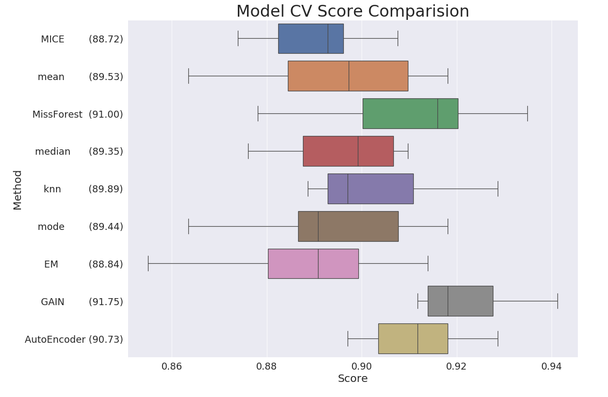

# Imputation (MCAR)
Missing Imputation Pkg Comparision

## 구현물

* 결측치 임의로 생성
* 결측치에 따른 성능 비교

## Based on DeepLearning
* GAIN 
* AutoEncoder 

 

## Based on Tranditional ML
* MICE 
* MissForest 
* knn 
* EM 

 

## Based on Statistics
* Mean 
* Medain
* Mode

 

## Algorithm Performance (NRMSE) (root) ( Missing Rate 20 % )

## Model Performance (정확도) ( Missing Rate 20 % )

